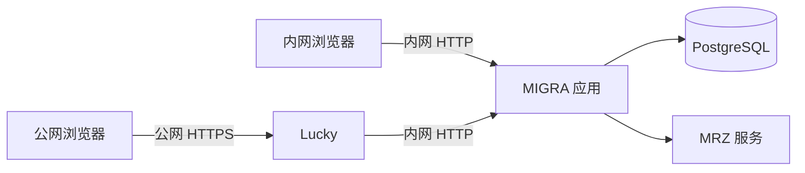

# MIGRA 移民订单管理系统

MIGRA 帮助小团队从签约到结案管理移民订单：项目模板、申请人、办理流程、材料、订单收付款、提醒和查询都围绕同一张订单展开。电脑端用于完整办公；手机端是可添加到桌面的移动工作台，方便外出时查看进度和处理简短事项。

> 当前主线：`main`，发布版本为 `v1.0.3`。最近一次源码提交见 [GitHub 提交记录](https://github.com/bringup113/immigration-order-manager-docker/commits/main)。部署前请以实际检出的提交、[当前状态](docs/IMPLEMENTATION_PLAN.md)和 CI 结果为准。

## 先看系统怎么工作


项目模板修改后不会改动已经创建的订单。新建订单只要求申请人的**系统显示名称**；护照资料和护照首页可以后补。收付款记录支持原币、USD 本位币和汇率联动，关联计划时可带入阶段说明，已按原币结清的计划不会继续产生待收待付提醒。搜索覆盖订单及关联的申请人、代理、项目、流程、收付款、材料等已索引字段；写入后索引异步更新，界面会提示“索引同步中”。搜索不读取 PDF 正文或图片文字。

订单编号由项目简称、签约日期和当日序号组成，例如 `SLLA_GFG-2026090701`。所有金额以整数最小货币单位保存，汇率以固定精度快照保存。

| 模块 | 主要能力 |
| --- | --- |
| 项目与材料模板 | 配置流程、应收/应付计划、材料清单；项目可导入/导出，订单保存创建时的模板快照 |
| 订单与申请人 | 按签约日期排序；申请人资料可分阶段补齐；流程完成后自动启动下一步 |
| 文件与 MRZ | 按订单/申请人/材料归档；图片、PDF 可预览；护照识别结果必须人工确认 |
| 财务 | 只登记订单实际收付；计划结清、作废/恢复和汇率快照均保留业务历史 |
| 团队与安全 | 系统所有者、管理员、只读和自定义角色；订单 `ALL`/`OWN` 范围、操作日志、设备会话和双重验证 |

## 页面与使用场景


*图中使用示例数据，根据当前源码绘制页面结构；不是业务数据截图。界面会随权限、订单和屏幕宽度变化。*

| 场景 | 电脑端 | 手机端 `/m` |
| --- | --- | --- |
| 看提醒、查订单、全局搜索 | 完整视图与管理入口 | 工作台、订单、搜索三个独立入口 |
| 办理订单 | 完整编辑、计划与配置 | 四个模块：办理与跟进、订单收支、申请人与材料、合同与付款 |
| 外出时处理事项 | 完整操作 | 完成当前步骤、新增跟进、分别登记收款/付款、上传与预览材料 |
| 护照资料 | 上传并人工确认 MRZ | 拍照或选文件，识别后仍须人工确认 |
| 新建订单、项目模板、角色、备份恢复 | 在电脑端完成 | “我的”中可主动切换到桌面版 |

手机端普通订单默认进入**办理与跟进**；工作台提醒和搜索结果会打开对应的订单模块。手机端主导航始终是工作台、订单、搜索、我的，只有在“我的”中主动点击“切换到桌面版”才离开手机页面。安装到手机桌面需使用正式 HTTPS 地址；离线时只显示通用提示，订单、财务、附件和登录数据不会被离线缓存。详细范围和真机验收状态见[移动工作台说明](docs/MOBILE_PWA_DEVELOPMENT_PLAN.md)。

## 本地 Docker 快速启动

需要 Docker Compose，以及 Node.js `22.13+` 与 npm（只用于准备环境和本地测试；应用运行在容器中）。首次启动：

```bash
cp .env.example .env
# 在 .env 中设置随机、足够长的 POSTGRES_PASSWORD
npm run docker:prepare
docker compose up -d --build
docker compose ps
```

打开 `http://127.0.0.1:3000`。空数据库第一次进入时，在登录页创建系统所有者；系统不生成默认账号或密码。移动工作台地址为 `http://127.0.0.1:3000/m`。`postgres_migrate` 会在应用启动前自动执行尚未运行的迁移，正常完成后退出；升级时不要删除旧迁移文件。

`docker:prepare` 会给 migrator、runtime、backup 生成独立随机密码，收紧 `.env` 权限，并检查 `data/files/` 与 `backups/postgres/` 的挂载权限。MRZ 服务也会由 Compose 启动；其镜像为 amd64，在 Apple Silicon 上由 Docker 模拟运行，x86_64 上原生运行。首次构建 MRZ 镜像可能较慢。

```bash
# 查看应用或 MRZ 日志
docker compose logs --tail=100 migra
docker compose logs --tail=100 mrzscanner_poc

# 用同一份源码重建并更新服务
docker compose up -d --build
```

## NAS 内网与 Lucky 公网

同一套 NAS 容器可同时提供内网 HTTP 和 Lucky 代理的公网 HTTPS：



在 `.env` 中按实际环境填写，例如：

```dotenv
NAS_BIND_ADDRESS=192.168.3.13
APP_PORT=3000
APP_ORIGIN=https://你的正式域名:8888
PUBLIC_DEPLOYMENT=1
REQUIRE_PRIVILEGED_MFA=1
```

`APP_ORIGIN` 是**公网浏览器地址的完整 origin**：带 `https://`，非标准端口要写端口，不带路径。内网 IP 不填进 `APP_ORIGIN`；直接打开 `http://NAS内网IP:3000` 仍可登录和使用。Lucky 的 HTTPS 前端指向 `http://NAS内网IP:3000`，传递原始 Host，并设置 `X-Forwarded-Proto: https`。公网模式要求系统所有者启用双重验证；内网和公网首次切换时需分别登录。

```bash
docker compose -f docker-compose.yml -f docker-compose.nas.yml up -d --build
docker compose -f docker-compose.yml -f docker-compose.nas.yml ps
```

具体填写示例、代理设置和排错见 [NAS 与 Lucky 部署说明](docs/NAS_ACCESS.md)。如果不用 Lucky、改由项目自带 Caddy 提供 HTTPS，见[部署与运维说明](docs/OPERATIONS.md)。

## 数据与备份

PostgreSQL 保存在 Docker 持久卷，附件保存在宿主机 `data/files/orders/`。自动备份和 `./scripts/backup-postgres.sh` **只备份数据库，不备份附件**；原始上传文件需要由使用者另行留档。启用双重验证后，还要单独保存 `APP_AUTH_SECRET` 或 `data/.auth-secret`，迁移服务器时与数据库配套恢复。

```bash
./scripts/backup-postgres.sh
./scripts/verify-postgres-backup.sh backups/postgres/migra-YYYYMMDD-HHMMSS.dump
./scripts/restore-drill-postgres.sh backups/postgres/migra-YYYYMMDD-HHMMSS.dump
```

正式恢复会停止应用，恢复后自动运行迁移并检查附件缺失、孤儿文件、大小和哈希；报告写入 `data/file-integrity-report.json`，不会自动删除附件。正式恢复命令、失败处理和备份锁说明见[部署与运维说明](docs/OPERATIONS.md)。

## 低资源运行与验证

搜索使用 PostgreSQL 的增量索引队列，不需要 Redis。默认数据库连接池为 5；列表和详情由服务端分页，文件上传与校验采用流式处理。MRZ 是独立 CPU 服务，可能成为整机内存的主要消耗。建议从 **4 GiB 内存**的完整系统开始在目标设备实测；低资源 Compose 只限制应用、数据库和备份容器，不保证 2 GiB 机器能稳定运行完整系统。

```bash
# 可选的容器资源上限
docker compose -f docker-compose.yml -f docker-compose.low-resource.yml up -d

# 本地源码检查：ESLint、生产构建、单元与策略测试
npm test
```

隔离集成、浏览器、备份恢复、MRZ 与 NAS 验收的具体条件见[当前验证记录](docs/CODE_QUALITY.md)和[部署与运维说明](docs/OPERATIONS.md)。历史压测是特定旧环境结果，不能直接当成当前 NAS 的容量承诺。

## 文档入口

| 文档 | 适合什么时候看 |
| --- | --- |
| [当前状态与下一步](docs/IMPLEMENTATION_PLAN.md) | 确认已完成事项和仍待真机验收的工作 |
| [移动工作台说明](docs/MOBILE_PWA_DEVELOPMENT_PLAN.md) | 手机页面、操作范围、PWA 与真机验收 |
| [NAS 与 Lucky 部署说明](docs/NAS_ACCESS.md) | 配置内外网、域名、代理与双重验证 |
| [部署与运维说明](docs/OPERATIONS.md) | 备份恢复、资源配置、运维命令与测试 |
| [开发约束](docs/DEVELOPMENT.md) | 修改业务代码时的权限、事务、审计和 CI 规则 |
| [当前验证记录](docs/CODE_QUALITY.md) | 当前源码的测试证据与已知边界 |
| [MRZ 服务说明](docs/MRZ_SIDECAR_POC_2026-09-14.md) | 识别参数、运行检查和性能边界 |
