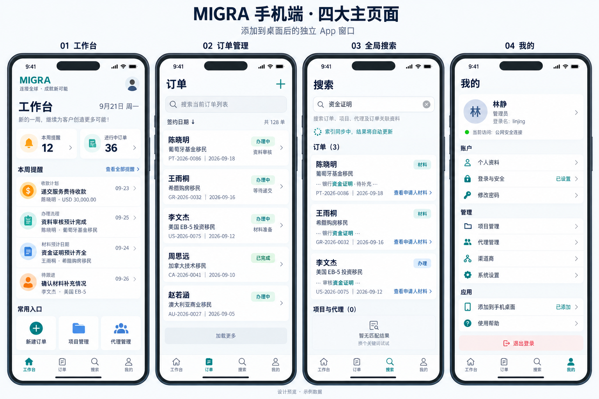
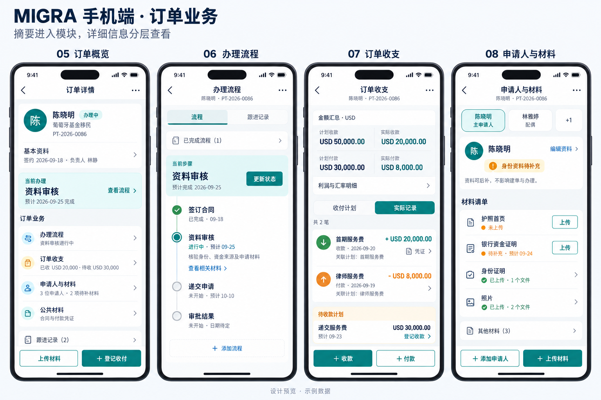
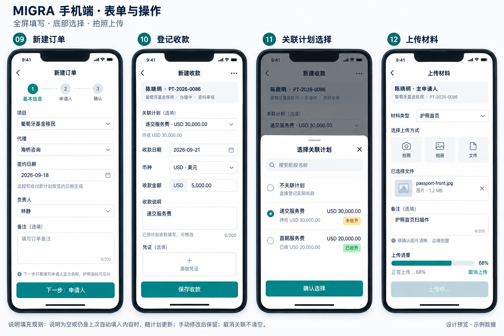

# 手机端与 PWA 开发计划

更新日期：2026-09-21。状态：**开发规划，尚未实现或部署**。

本计划依据 `v1.0.2` 稳定基线、已确认的产品要求和三组手机端效果图编写。计划和效果图已纳入版本管理，但手机端功能仍未实现或部署。长期开发约束遵循 [DEVELOPMENT.md](DEVELOPMENT.md)，已有发布事项见 [IMPLEMENTATION_PLAN.md](IMPLEMENTATION_PLAN.md)。

## 1. 目标与范围

在同一个项目中增加适合手机操作的前端，提供接近 H5 App 的导航、列表、表单和详情体验，并支持添加到手机桌面。继续使用现有账号、数据库、附件、搜索索引及 Docker 服务。

手机端重点支持查看提醒、查找订单、办理订单、登记收付款和上传材料。桌面端继续承担密集表格、项目模板配置和系统管理。两端共享业务规则与服务端授权，避免分别维护两套订单逻辑。

### 已确认的产品要求

| 项目 | 约定 |
| --- | --- |
| 底部主导航 | **工作台、订单、搜索、我的** |
| 全局搜索 | 独立页面；订单列表仍保留自己的订单搜索入口 |
| 工作台 | 提醒是主要内容；不恢复已删除的“最近更新订单”和提醒来源说明行 |
| 订单中的待办、跟进 | 保留功能，降低展示优先级，不作为订单首屏的核心卡片 |
| 提醒和搜索跳转 | 打开订单并切换对应模块即可，不定位具体行、不自动打开编辑框 |
| 新订单 | 选择项目后自动带入流程、收付款计划、材料模板；允许保存前调整 |
| 预计日期 | 从签订合同日期计算；手动修改过的日期必须保留 |
| 申请人 | 创建订单和开始办理只要求显示名称；护照信息和护照首页可以后补 |
| 收付款说明 | 选择计划时按现有规则自动填入阶段名称；取消关联仍保留说明文本 |
| 使用方式 | 支持手机浏览器及添加到桌面后的独立窗口 |

下文的路由命名、页面分组和分期方式属于实施建议。效果图用于确定视觉方向，不能覆盖业务校验或权限规则。

### 首版完成边界

- 四个主页面，以及订单概览、流程、收支、申请人材料、合同与付款材料。
- 新建订单、开始办理及现有生命周期操作的手机入口；现有前置校验保持一致。
- 流程操作、收付款登记与编辑、作废/恢复、申请人编辑、附件上传预览、MRZ 人工确认。
- 登录、必要的改密与双重验证、安全设置、退出登录，均能返回正确手机页面。
- 次要的订单待办、跟进与历史通过折叠区或“更多”访问。
- 项目、代理和系统管理的完整手机重设计不纳入首版；有权限的用户通过明确标注的“桌面管理”入口使用现有页面。全局搜索命中这些对象时也要有可用的落点。

首版不增加离线业务编辑、推送通知、原生安装包、独立手机后端或新的缓存服务。

## 2. 效果图与落地说明

以下三组图片来自本次设计讨论，由内置图像生成工具生成，共十二个示意屏幕。设计要点是紧凑的订单信息、清楚的模块层级、四项底部导航和适合触控的表单。

### 四个主页面

### 订单详情模块

### 新建与编辑操作

落地时需纠正和补齐的内容：

- 图片中的订单、金额、数量、日期和文字长度仅为示例，不是数据或校验标准。
- 新建订单必须表现“选项目 → 自动带入模板 → 检查或调整”的过程，不能让用户逐项重建流程和付款计划。
- 搜索命中流程应进入流程模块；以接口返回的 `target_tab` 为准，不能照搬图片中可能不一致的按钮文字。
- 流程状态来自真实数据，同一订单只允许一个进行中步骤；不照搬示意图中的重复步骤或状态。
- 收支采用现有“预计利润”“订单利润／当前订单利润”等口径；不能凭图片重新定义计算公式。
- 不加入无实际作用的宣传语、虚构统计或未经确认的必填条件。

## 3. 页面与导航设计

建议使用 `/m` 路由前缀。首版提供明确的“手机版／桌面版”切换入口，添加到桌面后直接进入 `/m/`；暂不使用强制设备识别跳转，避免平板、分享链接和登录回跳反复切换。

| 页面 | 建议路由 | 主要内容与行为 |
| --- | --- | --- |
| 工作台 | `/m/` | 当前提醒、日期范围、分类数量、提醒列表；点击进入对应订单模块 |
| 订单 | `/m/orders` | 订单搜索、现有排序选项、分页列表、新建入口；默认签约日期倒序 |
| 全局搜索 | `/m/search` | 搜索框、命中摘要、索引同步状态、分组结果及继续查看入口 |
| 我的 | `/m/me` | 当前身份、个人资料与安全设置、安装说明、桌面管理入口、退出登录 |
| 新建订单 | `/m/orders/new` | 基本信息、申请人、模板预览与确认，分步保存前校验 |
| 订单详情 | `/m/orders/[orderNo]` | 概览及模块入口；以 `tab=workflow/finance/people/common` 表示当前模块 |
| 安全设置 | `/m/me/security` | 改密、MFA、会话管理；复用现有权限和身份校验 |

订单概览用默认状态表示，`tab` 参数继续只接受已有白名单。非法或无权限模块回退到允许访问的默认模块，服务端仍须独立鉴权。

### 工作台

- 提醒继续来自现有服务端汇总，不能在手机端自行用流水或分页数据计算。
- 已完成收付款计划不再提示待收待付；作废/恢复后的提醒变化遵循现有规则。
- 一屏优先展示日期、事项、来源订单和必要金额；低优先信息放入次级文字。
- 保留手动刷新入口。首版不添加常驻轮询，也不让后台请求延长空闲会话。

### 订单列表

- 单条显示主申请人／订单号、项目、状态、签约日期、当前流程；财务信息仅在有权限时展示。
- 使用现有服务端搜索与排序规则，不增加复杂筛选面板。
- 首版建议采用每页十条与明确的上一页／下一页，避免无限列表在低配手机上持续增加内存。
- 从详情返回时恢复列表页码、排序和滚动位置。修改搜索词或排序时重置页码并取消旧请求。
- 下一页根据服务端分页信息启用，不能由当前页恰好十条或某个财务字段推断；覆盖十条以上和最后一页删除后回退的情况。

### 全局搜索

当前代码不仅搜索订单，也返回有权限查看的项目和代理。订单索引包含流程、收付款、申请人、材料及其他已索引信息；不承诺搜索未被提取的附件正文或图片文字。

- 按订单、项目、代理分组展示结果；无权限的组不发起额外请求、不暴露摘要。
- 订单卡片显示命中来源和简短上下文。跳转只切模块，复用 `target_tab` 映射。
- 有输入且 `indexing=true` 时自动刷新，沿用当前一秒、二秒、四秒、最高八秒退避，总窗口最多六十秒。
- 用户修改搜索词、退出页面或页面隐藏时，取消旧定时器与请求，并用请求版本阻止迟到响应覆盖状态。
- 同步完成后显示最后一次查询的结果并停止轮询；不清空输入、不强制跳转、不重置正在查看的结果位置。
- 超时停止自动请求并保留“索引同步中／稍后刷新”提示。回到前台可重新确认一次状态，再按新的有限周期处理。
- 网络错误、会话过期、空结果与索引同步分别展示；处理接口返回 HTML 或非 JSON 的错误，不能把解析异常直接显示给用户。

**当前接口边界：**订单匹配查询最多返回十二条，项目、代理文本查询各最多八条，不能把结果数量写成“全部”。独立搜索页上线前应补充分组分页及 `hasMore`，保留现有桌面调用的默认响应行为。使用受限页大小和稳定排序；跨页索引变化时去重，并允许用户重新搜索，不承诺跨请求快照一致性。不得通过一次读取全部订单绕过限制。

### 订单详情与次要内容

- 首屏突出身份、项目、状态、签约日期、当前流程和有权限的收支摘要。
- 主要模块为流程、收支、申请人与材料、合同与付款。待办与跟进置于流程内的次级入口，历史按需读取。
- 提醒与搜索通过同一导航函数解析 `target_tab`；只根据桌面／手机选择不同路径，不各写一套命中判断。
- 首屏和切模块按现有 `section` 接口加载。模块数据可以短期留在当前内存，写入成功后使相关摘要、列表和模块失效刷新。
- 收支汇总必须由整张订单计算，不能用当前页流水求和；流水和跟进继续服务端分页。

## 4. 新建订单：模板自动填充是核心流程

建议分为“基本信息 → 申请人 → 检查并创建”三步。模板预览在选项目成功后立即出现，最后一步汇总检查；步骤划分不能让模板自动填充变成隐藏行为。

| 场景 | 必须保持的行为 |
| --- | --- |
| 初次打开 | 加载轻量项目、代理等选择项，不加载全部项目的模板 |
| 选择项目 | 请求该项目模板，自动带入流程、应收／应付计划、材料及当前规则中的默认项 |
| 快速切换项目 | 取消或忽略旧响应，只有当前项目响应能更新预览 |
| 模板加载失败 | 明确提示并可重试；未准备好时不能提交出不完整的订单 |
| 修改签约日期 | 仅重算 `template` 模式的预计日期，以签约日期加模板偏移天数计算 |
| 用户手改日期 | 标记为 `manual`，后续修改签约日期不能覆盖该日期 |
| 修改模板内容 | 允许按现有能力调整；在步骤间返回时保留草稿 |
| 已有手工修改又切项目 | 提示将替换的流程、计划等内容；确认后加载新模板，避免静默丢失手工调整 |
| 项目保存后被别人修改 | 由服务端按现有模板校验处理；冲突时保留表单并提示重新检查 |
| 点击创建 | 使用现有接口创建 `DRAFT`，明确告知保存成功；开始办理仍是后续显式操作 |

关键约束：

1. 模板来源和模式字段必须保留，日期不能只在界面算一次。服务端继续验证模板编号、偏移天数与手动日期。
2. 项目后续修改不回写已有订单快照。手机端不能新增“自动同步项目修改”行为。
3. 当前服务端在某些模板数组为空时会回退项目模板。界面不能把“删光行”默认为“创建空模板”；如要支持明确清空，先单独设计数据契约和测试，不在此次 UI 改造中悄悄改变。
4. 恰好一名主申请人；显示名称必填。护照字段未填、未上传护照首页都不能阻止创建或开始办理；填写了的字段仍按原规则校验。
5. 上传与订单创建是分开的请求。订单已建成但附件失败时，应进入已创建订单重试附件，不能重发创建订单造成重复。
6. 提交期间禁用重复按钮。网络超时不自动重试写操作；先确认订单是否已经创建，仍无法确认时给出可恢复提示。客户端按钮禁用不等同于服务端幂等保证。

## 5. 收付款、申请人和附件

### 收付款表单

- 新建收款与付款使用适合手机的全屏表单；计划选择使用可滚动底部面板。
- 计划选项至少显示“阶段名称 + 币种 + 计划金额”；如展示已完成／剩余金额，使用现有服务端口径，不混用原币与本位币。
- 收款仅选择相应应收计划，付款仅选择相应应付计划；保留现有服务端关联校验。
- 保留整数最小货币单位、汇率快照和金额联动规则，复用计算模块；关联计划不自行新增“覆盖实际金额”的行为。

说明自动填充规则：

| 操作 | 说明字段处理 |
| --- | --- |
| 新建时说明为空，选择计划 | 填入该计划阶段名称，记录为本次自动文本 |
| 说明仍等于上次自动文本，改选计划 | 更新为新阶段名称 |
| 用户已编辑说明 | 保留用户文本 |
| 取消关联或更换收付方向 | 保留说明，结束旧关联的自动跟踪 |
| 打开已有收付款记录 | 保留已保存说明，不把它当作本次自动填入内容 |
| 关闭后重新打开表单 | 重新初始化跟踪状态，不沿用上一笔记录的状态 |

删除计划、作废／恢复流水继续使用统一确认组件和现有权限；财务变更后刷新计划进度、订单摘要和关联提醒。

### 申请人与附件

- 手机端以申请人为分组，明确区分申请人材料和公共的合同／付款材料。
- 护照首页材料入口保持存在，可显示待补充，但不能成为创建订单或开始办理的必填门槛。
- 提供拍照、相册／文件选择；保留普通文件选择作为兼容入口，不强制相机。
- 沿用实际允许的文件格式、单文件大小和并发上限；图片中的限制文字不作为实现依据。
- 上传显示状态与失败原因，可单文件重试；不要把多份大文件同时读入内存。离开上传界面时说明是否仍在上传或需要重试。
- PDF 与大图预览按需加载，关闭时释放对象 URL、预览资源和取消中的请求。
- MRZ 识别结果必须人工检查确认；识别失败可手工录入。不能因为识别不可用而阻断普通订单流程。

## 6. 代码结构与复用入口

| 现有入口 | 手机端复用方式 |
| --- | --- |
| `app/layout.tsx`、`app/chatgpt-auth.ts`、`components/current-user-provider.tsx` | 共享会话和用户上下文；梳理布局鉴权及手机返回路径 |
| `components/app-shell.tsx` | 保留桌面壳；抽出搜索状态、导航映射和安全重定向策略供手机使用 |
| `app/orders/page.tsx`、`lib/order-list.ts`、`lib/order-sort.ts` | 共享列表请求参数、分页和排序；手机单独渲染紧凑列表 |
| `app/orders/new/page.tsx`、`lib/order-template-dates.ts` | 抽出建单草稿与模板联动逻辑，避免复制大型页面 |
| `lib/order-catalog-query.ts`、`lib/order-service.ts` | 沿用模板查询、建单事务、快照和校验 |
| `lib/global-search-query.ts`、`lib/order-search.ts` | 沿用权限过滤、索引和命中信息，补充分组分页 |
| `lib/order-detail-query.ts`、`app/api/orders/[orderNo]/route.ts` | 按模块加载详情，复用统一订单动作入口 |
| `hooks/use-order-*-actions.ts`、`hooks/use-order-people-materials.ts` | 评估表单依赖后提取共享状态与动作；显示层独立 |
| `lib/order-finance.ts`、`lib/cash-calculation.ts`、`lib/amount.ts` | 复用财务业务与金额计算 |
| `lib/order-access.ts`、`lib/order-action-policy.ts`、`lib/order-action-audit.ts` | 共享权限、订单范围、生命周期动作和审计 |
| `app/api/material-files/`、`app/api/mrz/scan/` | 沿用附件访问控制和 MRZ 接口 |

建议新增 `components/mobile/` 保存手机视觉组件，在 `app/m/` 组织业务路由。具体目录根据鉴权布局调整；不要仅复制整个桌面页面后分别维护。抽取共享逻辑时先保持桌面行为，用已有回归锁定业务，再接手机展示。

开发约束：

- 保持现有 Next.js、React、图标及基础组件体系，不额外引入一整套手机 UI 框架。
- 页面负责展示；请求状态与交互放入合适的 hook；金额、日期、权限与数据库事务保留在共享层。
- 公共 DTO 使用同一类型来源。移动样式限定作用域，避免全局 CSS 影响桌面。
- 不同时挂载隐藏的桌面与手机页面，防止重复请求、重复表单和重复监听。
- 用户权限、`ALL/OWN` 数据范围、审计与后台校验在所有入口一致；隐藏按钮不能代替服务端授权。

### 上线前必须补齐的数据契约

1. **列表签约日期：**当前列表按签约日期排序，但返回字段未包含 `signed_at`。增加该字段及共享类型后，手机才能准确展示，不能拿创建时间代替。
2. **搜索分页：**定义分组、页大小、继续查询标记和响应类型；旧桌面默认查询保持可用。覆盖十二条订单、八条项目／代理以上的数据集。
3. **导航与登录：**统一合法模块映射及安全的 `return_to`；登录、改密、MFA 完成后回到手机目标页面。
4. **请求错误：**共享处理状态码、非 JSON 响应、会话失效、权限拒绝与取消；不把失败结果当作成功空列表。

以上通常不需要新增业务表。若实现期间确实需要数据库结构变化，另写顺序迁移并验证空库与已有库升级，不能直接改已发布迁移。

## 7. PWA、登录和内外网

### 安装与入口

建议 manifest 使用稳定 `id`、`start_url=/m/`、`scope=/m/`、`display=standalone`，准备一百九十二和五百一十二像素图标、maskable 图标及 Apple touch 图标。manifest、图标和通用离线提示必须能在未登录时获取，并使用正确的内容类型。

Next.js 支持通过 manifest 文件约定提供清单，具体实现遵循[官方 manifest 文档](https://nextjs.org/docs/app/api-reference/file-conventions/metadata/manifest)。安装提示按浏览器能力展示，不能依赖所有平台都有 `beforeinstallprompt`；清单安装也不意味着必须先实现 Service Worker。见 [MDN 安装条件](https://developer.mozilla.org/en-US/docs/Web/Progressive_web_apps/Guides/Making_PWAs_installable)。

iPhone 提供 Safari“共享 → 添加到主屏幕”指引，并在系统提供该选项时开启“作为网页 App 打开”；安卓根据浏览器实际提供的安装菜单引导，不承诺所有浏览器体验一致。参见 [Apple 官方说明](https://support.apple.com/guide/iphone/open-as-web-app-iphea86e5236/ios)。

### 内网与公网使用说明

- 公网 PWA 使用证书有效的 HTTPS 地址；如果保留 `8888` 端口，需确保该端口实际提供 HTTPS，不能只把链接文字换成 `https`。
- `http://192.168.3.13:3000` 可以继续作为普通内网页面入口，但不作为完整 PWA 安装及 Service Worker 的验收地址。手机访问另一台设备的局域网 IP 不属于 localhost 安全上下文例外。
- 推荐内外网共用同一个 HTTPS 域名，通过局域网 DNS 或代理安排内网访问；如另用内网 HTTPS 域名，证书需被手机信任，并纳入现有登录来源配置。
- 不同域名、协议或端口是不同来源，会话、缓存和安装状态不能假定共享。“我的”安装说明应显示当前实际访问地址。
- Lucky 的 TLS、转发协议和来源配置沿用现有部署规范；不能为了手机登录取消 Origin 校验或扩大为任意来源。

### 登录与安全流程

当前根布局执行鉴权，桌面壳也包含强制改密／MFA 跳转。开发第一阶段必须先梳理这些入口，避免在手机布局外再套一层桌面壳，或安全设置被重定向循环。

- 登录继续使用现有身份服务与 Cookie，不增加浏览器持久令牌。
- 决定登录呈现采用 `/m/login` 薄页面还是调整现有登录页时，必须先验证根布局和公开路由。即使增加手机登录外观，也只复用现有认证逻辑。
- 保留安全的站内返回地址，覆盖深链、会话过期、退出后重登，以及 MFA 中途离开再返回。
- 公网模式下系统所有者的强制 MFA 与受限访问规则保持；其他角色依照现有策略，不统一强制开启。
- manifest／图标公开只针对这些静态资源，不放开订单页面、API 或附件权限。

### 缓存与离线

首版先完成 manifest 和安装，再增加范围受控的 Service Worker；其使用要求见 [MDN Service Worker 文档](https://developer.mozilla.org/en-US/docs/Web/API/Service_Worker_API)。

- 仅在生产 HTTPS 环境注册，作用域限定 `/m/`，缓存使用独立前缀与版本。
- 只允许缓存明确列出的公开静态资源，如图标、带内容哈希的脚本／样式、无用户信息的离线提示。
- 订单、搜索、财务、登录、附件、服务端组件数据和含用户信息的 HTML 均走网络，不进入 Service Worker 缓存。
- 缓存前验证状态、内容类型及是否重定向，避免把登录 HTML 缓存成脚本或接口数据。
- 离线明确提示联网后继续；禁用业务提交，不排队补发收付款或订单写操作。
- 新版本提示“更新可用”，用户保存或放弃当前表单后再刷新；不强制激活新 worker 打断填写。
- 缓存清理仅删除本应用自己的旧缓存；退出登录清除业务内存状态，不保留客户搜索历史或表单到 localStorage。
- 回滚方案包括 worker 更新和自身缓存清理，不能只回滚镜像后假定所有手机立即使用旧代码。

## 8. 手机体验与资源控制

- 以三百六十至四百三十像素手机为主要视口；适配安全区、横屏、软键盘和系统文字放大。
- 主要点击目标至少约四十四 CSS 像素；表单使用可读字号，避免依赖悬停或仅靠颜色识别状态。
- 底部导航与保存按钮不要相互遮挡；键盘弹出后仍能看到当前字段和错误提示。
- 长订单号、长名称、不同币种和大金额有可读的换行／展开方式，主要页面不出现整页横向滚动。
- 主导航可常驻，进入新建／编辑时突出返回与保存，避免误触离开；有未保存修改才提示确认。
- 只按当前页面、当前模块读取数据；列表不下载附件，PDF/MRZ 不进入首屏必需资源。
- 保留有限的内存状态以支持返回，不持久化敏感草稿；明确刷新或系统回收页面可能丢失未提交内容。
- 采用当前搜索索引与 PostgreSQL 查询，不因增加手机前端引入 Redis。是否再加缓存，应由目标机器的实测慢查询和负载决定。

性能验收使用同一构建、同一测试数据与同一设备比较改造前后：记录首屏资源、请求数、列表／搜索响应分位耗时、浏览器内存和 NAS 峰值资源。建议在网络与设备参数固定后，以常用页面 LCP 不超过二点五秒、交互延迟不超过二百毫秒作为待验证目标，不能当作已达到的承诺。

同时使用至少二十、二百、两千张测试订单检查分页与搜索，并模拟大附件和较多流水。初次进入任何一个页面都不得拉取全部订单、全部项目模板或全部附件。实际容量结论以目标 NAS 实测为准。

## 9. 分阶段实施

| 阶段 | 工作 | 交付与完成门槛 |
| --- | --- | --- |
| M0：业务与接口准备 | 固定已确认规则；核对权限、模板、金额、搜索分页、导航和鉴权；记录桌面基线 | 数据契约与回归场景明确；已有修复可区分；不复制业务代码 |
| M1：手机基础与阅读页面 | 手机布局、四项导航、工作台、订单分页排序、全局搜索、只读详情；补 `signed_at` 与搜索分页 | 真数据可浏览；提醒／搜索跳转正确；桌面阅读行为无回归 |
| M2：新建与模板 | 建单共享状态、项目异步加载、分步表单、模板调整、日期联动、仅姓名申请人 | 可以完整创建草稿；模板／手工日期测试通过；失败可恢复 |
| M3：办理与收付款 | 生命周期、流程、计划和流水操作；次要待办／跟进入口 | 权限与审计完整；说明自动填充不覆盖手工文本；汇总与提醒正确 |
| M4：申请人与材料 | 手机上传、预览、作废／恢复、MRZ 确认、公共材料 | 真机拍照／选文件可用；上传失败不重复创建业务记录；内存释放正常 |
| M5：安装与安全闭环 | 我的、安全设置、登录回跳、manifest、图标、静态缓存与更新提示 | iPhone／Android 浏览器及桌面启动通过；离线和更新不丢失已提交数据 |
| M6：回归与发布 | 扩展 CI、真机、低配测试、恢复演练、HTTPS 代理验证、回滚验证 | 验收清单通过后建立新版本；再按发布安排部署 NAS |

阶段按顺序推进；每次共享逻辑调整都运行相应桌面回归。M1 可供试用视觉与浏览，不能因此宣称完整手机端已经完成。系统管理重设计另行评估，不混入本轮主流程。

## 10. 测试与验收清单

### 自动化

- [ ] 手机端受保护路由、直接深链、无权限模块与 `ALL/OWN` 范围不泄露数据。
- [ ] 普通角色和系统所有者的登录、强制改密、MFA 及返回路径符合既有策略。
- [ ] 订单分页覆盖零／十／十一／多页数据、排序同值、修改查询、尾页删除与返回恢复。
- [ ] 搜索覆盖组合条件、不同命中模块、各分组分页、索引同步结束、超时、隐藏页面及迟到响应。
- [ ] 提醒和搜索落到正确订单模块；已完成计划不提醒，作废／恢复后数据一致。
- [ ] 项目快速切换、请求失败、模板日期联动和手动日期保护正确。
- [ ] 仅显示名称即可创建；缺护照不阻断开始办理；主申请人及已填字段校验不放宽。
- [ ] 收付款说明的空白、自动文本、手工文本、改选、取消、编辑旧记录和重新打开全部覆盖。
- [ ] 金额、汇率、计划关联、分页汇总、生命周期限制和审计保持一致。
- [ ] 上传失败可重试，MRZ 失败可人工处理；不能因超时自动重复业务写入。
- [ ] manifest／图标公开可读；未授权 HTML、API、附件及重定向错误未被缓存。
- [ ] 离线、版本更新和回滚不会自动重发订单或收付款操作。

现有 `npm test`、`test:backup`、`test:prepare`、`test:integration`、`test:mrz-transfer`、`test:browser`、`test:browser:current` 按仓库规范继续执行。新增手机浏览器测试脚本与 CI 步骤应在实现时一起提交，不能只写入文档；运行环境必须是隔离测试服务与数据库。

### 真机与运维

- [ ] iPhone Safari 普通窗口、添加到主屏幕后的窗口均验证登录与主要流程。
- [ ] Android 浏览器、安装后的窗口验证返回键、上传、下载与重新打开。
- [ ] 三百六十／三百九十／四百三十像素手机、平板及桌面视口没有布局回归。
- [ ] 长文本、大金额、软键盘、安全区、文字放大、慢网及断网体验可用。
- [ ] 目标 HTTPS 域名经 Lucky 登录成功；内网普通入口仍可用，内外网说明与实际配置一致。
- [ ] NAS 查询、内存、附件上传和 MRZ 峰值已测量；结论记录设备与数据规模。
- [ ] 数据库恢复演练及附件缺失／孤儿／哈希检查通过；延续“不备份附件”的既有政策。
- [ ] 镜像更新、PWA 更新、旧窗口和回滚组合验证通过后再发布。

浏览器模拟视口不能替代 iOS／Android 真机安装验证。CI 负责可重复业务回归，真机负责系统入口、证书、键盘和文件选择器等平台行为。

## 11. 发布与文档维护

1. 在当前修复基础上分阶段提交，先完成隔离验证，不覆盖正在使用的 NAS 服务。
2. 构建完整、匹配的前后端镜像；测试使用当前迁移历史，必要新增迁移由现有迁移容器执行。
3. 发布前保留现有数据库、附件目录、环境配置与 MFA 密钥，完成可重复恢复演练。
4. 先以明确手机入口试用，桌面入口持续可用；通过全部发布门槛后建立版本标签并部署。
5. README 补充公网 HTTPS、内网使用、安装步骤、更新与退出说明；开发规范补充共享逻辑和缓存边界。
6. 实测结果写入单独报告，记录版本、硬件、数据量和测试条件。本计划中的目标与未勾选项不得作为完成证明。

本次文档交付包含开发范围、页面说明、业务规则、源码复用入口、实施阶段、测试与发布标准。开发和 NAS 更新需按上述阶段实际执行并留下验证记录。
