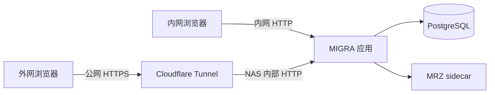

# NAS 内网与 Cloudflare Tunnel 公网访问配置

本项目支持同一套 NAS 容器同时从内网 IP 和 NAS 内置 `cloudflared` 的公网域名访问。当前环境为：

- 内网：`http://192.168.124.88:3000`
- 公网：`https://order.tcvisa.vip`
- Tunnel 服务地址：`http://192.168.124.88:3000`


```mermaid
flowchart LR
  A[内网浏览器] -->|内网 HTTP| M[MIGRA 应用]
  B[外网浏览器] -->|公网 HTTPS| L[Cloudflare Tunnel]
  L -->|NAS 内部 HTTP| M
  M --> D[(PostgreSQL)]
  M --> R[MRZ sidecar]
```

## `.env` 怎么填写

在项目根目录的 `.env` 中保留数据库账号、随机密码、UID/GID 等现有内容，并确认以下项目：

```dotenv
NAS_BIND_ADDRESS=192.168.124.88
APP_PORT=3000
APP_ORIGIN=https://order.tcvisa.vip
PUBLIC_DEPLOYMENT=1
REQUIRE_PRIVILEGED_MFA=1
```

各项含义：

| 配置 | 填写内容 | 作用 |
| --- | --- | --- |
| `NAS_BIND_ADDRESS` | NAS 固定内网 IP | 决定 Docker 只监听哪一个内网地址 |
| `APP_PORT` | NAS 应用端口 | 与内网访问地址和 Tunnel 服务端口一致 |
| `APP_ORIGIN` | 完整公网 HTTPS origin | 校验公网登录和写入请求；非标准端口必须填写 |
| `PUBLIC_DEPLOYMENT` | `1` | 启用公网安全策略 |
| `REQUIRE_PRIVILEGED_MFA` | `1` | 兼容旧配置名称；当前只强制系统所有者启用 MFA |

`APP_ORIGIN` 的正确形式是“协议 + 域名 + 可选端口”，例如：

```text
https://order.tcvisa.vip
```

不要填写以下内容：

```text
order.tcvisa.vip                      # 缺少 https://
https://order.tcvisa.vip/login        # 包含路径
http://192.168.124.88:3000            # 这是内网入口，不是正式公网来源
http://0.0.0.0:3000                   # 0.0.0.0 不是浏览器访问地址
```

标准 HTTPS 443 不需要显式端口。如果将来公网域名或端口变化，先修改 `APP_ORIGIN`，再重新创建应用容器。

## 为什么只填公网地址，内网仍能使用

登录或修改数据时，服务端按以下顺序判断来源：

1. 浏览器明确标记为第三方跨站请求时直接拒绝。
2. Origin 与 `APP_ORIGIN` 完全一致时，接受公网请求。
3. Origin 的主机和端口与本次请求的 Host 一致时，接受内网同源请求。
4. 其余来源拒绝，并记录安全审计日志。

因此内网用户直接打开 `http://192.168.124.88:3000` 即可登录和使用全部已授权功能，不需要把内网地址并入 `APP_ORIGIN`。公网和内网会分别保存 Cookie，第一次从另一个入口进入时需要重新登录。

## Cloudflare Tunnel 怎么填写

在 NAS 内置 Cloudflare Tunnel 中添加公开主机名：

| 项目 | 值 |
| --- | --- |
| 公开主机名 | `order.tcvisa.vip` |
| 服务类型 | HTTP |
| 服务地址 | `192.168.124.88:3000` |
| 公网协议 | HTTPS，由 Cloudflare 提供证书 |

`cloudflared` 从 NAS 主动连接 Cloudflare，不需要把 3000 端口映射到公网路由器。主应用继续使用内网 HTTP；PostgreSQL 的 54329 和 MRZ 的 8090 都不得配置为 Tunnel 公开服务。

## 部署与更新

NAS + Cloudflare Tunnel 固定使用基础 Compose 和 NAS 覆盖文件；`cloudflared` 由 NAS 管理，不加入本项目 Compose：

```bash
docker compose -f docker-compose.yml -f docker-compose.nas.yml up -d --build
```

查看状态和日志：

```bash
docker compose -f docker-compose.yml -f docker-compose.nas.yml ps
docker compose -f docker-compose.yml -f docker-compose.nas.yml logs --tail=100 migra
```

只修改 `.env` 中的来源或安全开关时，也要重新创建应用容器，使环境变量生效：

```bash
docker compose -f docker-compose.yml -f docker-compose.nas.yml up -d --force-recreate --no-deps migra
```

## 部署后验证

内网页面：

```bash
curl -I http://192.168.124.88:3000/
```

公网登录页：

```bash
curl -I https://order.tcvisa.vip/api/auth/login
```

两边都应返回正常页面或跳转到登录页，不应再出现“已拒绝来自其他网站的登录请求”。如果只在公网失败，先核对 `APP_ORIGIN` 是否与浏览器地址的协议、域名和端口完全一致；如果只在内网失败，核对访问地址是否与 `NAS_BIND_ADDRESS`、`APP_PORT` 一致。

## 双重验证规则

公网模式只强制系统所有者设置双重验证。系统所有者未设置时可以登录并进入“登录与安全”，但业务写入会提示先完成设置。管理员、只读用户和自定义角色不会被强制，可以自行选择启用；已经主动启用的账号登录时仍需输入动态码。
