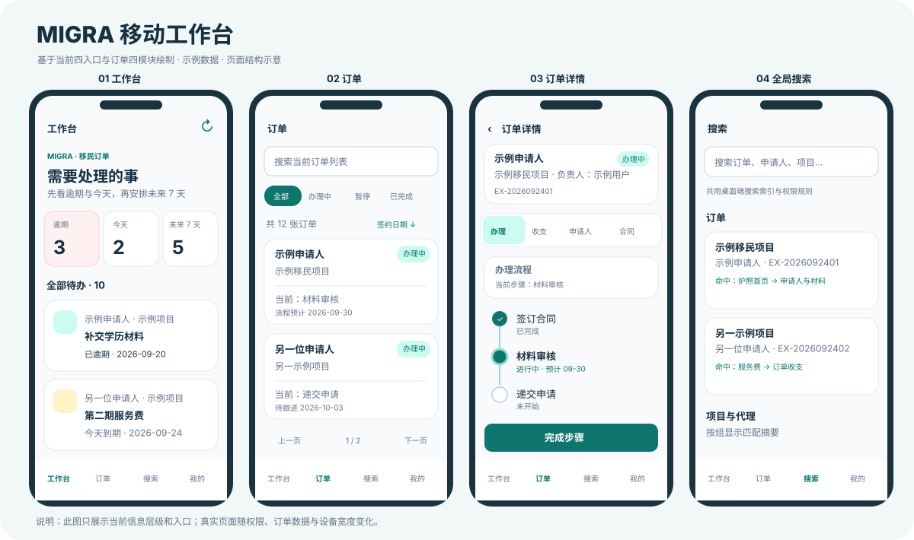

# 手机端图稿说明

`current-workbench.svg` 按当前源码的工作台、订单列表、四模块订单详情和全局搜索绘制，使用示例数据，用于说明信息层级；它不是实际业务截图。真实界面会随权限、订单内容与设备宽度变化。

下面三张 PNG 是早期概念图，保留作设计过程参考，**不代表当前已实现功能**：其中的手机新建订单、独立订单概览、项目/代理管理入口等已经从手机工作台范围移除。

- [早期四个主页面](01-main.png)
- [早期订单业务页](02-order.png)
- [早期表单与操作页](03-forms.png)

当前功能边界请以[移动工作台说明](../../MOBILE_PWA_DEVELOPMENT_PLAN.md)与源码为准。
