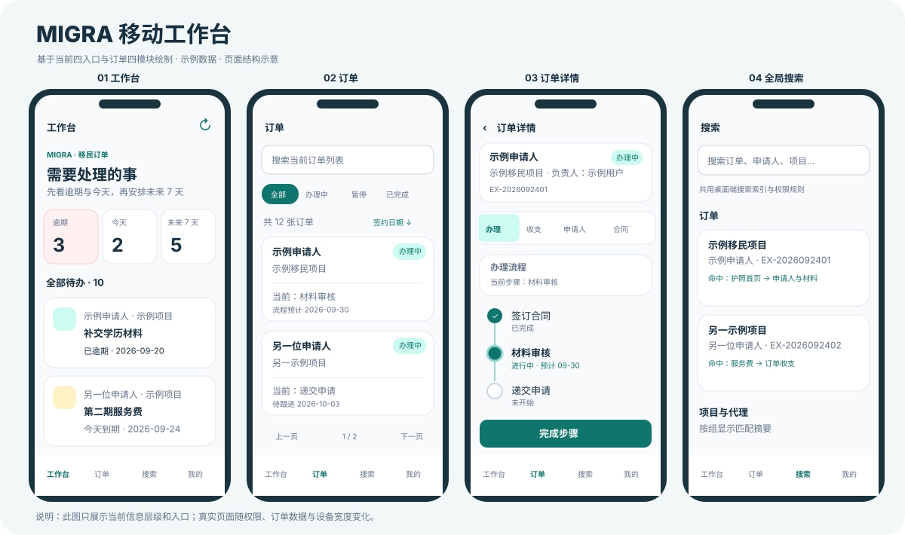

# 手机端图稿说明

`current-workbench.svg` 按当前源码的工作台、订单列表、四模块订单详情和全局搜索绘制，使用示例数据，用于说明信息层级；它不是实际业务截图。真实界面会随权限、订单内容与设备宽度变化。

过时概念图已删除，避免把已经取消的手机建单、独立订单概览和管理入口误认为现行功能。当前功能边界请以[移动工作台说明](../../MOBILE_PWA_DEVELOPMENT_PLAN.md)与源码为准。
